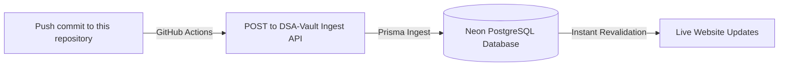

# 💻 LeetCode – DSA Solutions Journal

<p align="center">
  
  
  
  
  
</p>

---

This repository houses my personal solutions, complexity analysis, and explanations for various coding challenges solved across LeetCode. It acts as a continuous journal of my Data Structures and Algorithms (DSA) training.

🌐 **Live Solutions Portfolio**: **[https://ubiquitous-dango-feef0b.netlify.app](https://ubiquitous-dango-feef0b.netlify.app)**

---

## ⚡ Automated Publishing Pipeline

This repository is connected via a secure **GitHub Actions Webhook** to **DSA-Vault**, a Next.js 16 Web Application. 

Every time a solution is pushed to the `main` branch, a workflow parses the directory modifications, verifies signature keys, imports metadata to a Neon PostgreSQL database, and triggers real-time page updates instantly!



---

## 📁 How to Structure Solutions

To ensure a folder is parsed and published correctly to the website, format your directories as follows:

1. **Folder Name**: E.g., `Problem - 1. Two Sum`
2. **Problem Description File (`README.md`)**:
   * The first line must contain the title and difficulty:
     ```markdown
     # Two Sum (Easy)
     
     ---
     Description text goes here...
     ```
3. **Solution Code Files**:
   * Place code files (e.g. `Solution.cpp`, `Solution.java`, `Solution.sql`) in the same directory.
   * Multiple languages can be added to the same problem folder and will show up as selectable tabs on the website.

---

## 🛠️ GitHub Actions Workflow Configuration

To check or update the sync URL, view the workflow file:
`.github/workflows/sync-website.yml`

Ensure the `SYNC_URL` points to:
`https://ubiquitous-dango-feef0b.netlify.app/api/sync/github`
And that `SYNC_SECRET` is added as an Actions Repository Secret.
